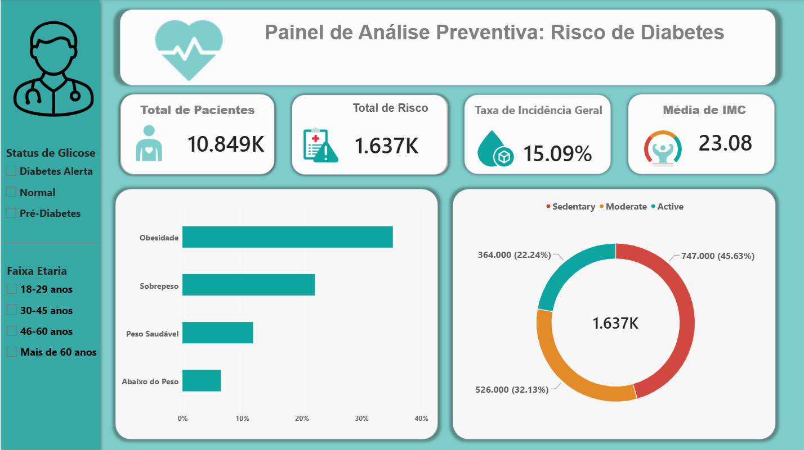

# Dashboard de Análise Preventiva de Risco de Diabetes

Um projeto abrangente de Engenharia de Dados e Business Intelligence focado na identificação de perfis de risco de pacientes, análise de distribuição do Índice de Massa Corporal (IMC) e avaliação de comportamentos de estilo de vida para apoiar decisões preventivas na área da saúde.



## Etapa 1: Engenharia de Dados (SQL Server)
Em vez de carregar os arquivos brutos diretamente na ferramenta de BI, apliquei **Feature Engineering** na camada do banco de dados para garantir performance, integridade dos dados e centralização das regras de negócio.

### Ações Realizadas no Banco de Dados:
1. **Limpeza e Tipagem de Dados:** Tratamento de tipos de dados específicos para valores numéricos de precisão (`DECIMAL`, `INT`).
2. **Categorização Clínica (Regras da OMS):** Automatização da segmentação por faixa etária e classificações médicas para `BMI` (IMC), `Fasting_Blood_Sugar` (Glicemia de Jejum) e `HbA1c_Level` (Hemoglobina Glicada) utilizando consultas estruturadas com `CASE WHEN`.
3. **Score de Risco de Estilo de Vida:** Agregação de múltiplas variáveis comportamentais (`Smoking_Status`, `Alcohol_Consumption`, `Physical_Activity_Level`) num índice preditivo de risco unificado.
4. **Modelagem Dimensional:** Desconstrução do arquivo único original (flat file) num modelo **Star Schema**, dividindo os dados numa tabela central `Fato_Pacientes` e numa tabela otimizada `Dim_EstiloVida` (Dimensão) para maximizar a performance dos joins.

> 📂 *Todos os scripts SQL completos para criação de tabelas e Views encontram-se dentro do ficheiro `011_pipeline_dados.sql` neste repositório.*

---

## Etapa 2: Business Intelligence (Power BI)
Os dados otimizados foram importados para o Power BI através de **SQL Views** utilizando o **Modo Import** (mecanismo VertiPaq) para interações ultra-rápidas no relatório.

### Métricas Desenvolvidas (Fórmulas DAX):

```dax
Total Pacientes = 
COUNT(Fato_Pacientes[Patient_ID])
```

```dax
Taxa Diabetes = 
DIVIDE(
    CALCULATE(
        [Total Pacientes], 
        Fato_Pacientes[Diagnostico] = 1
    ), 
    [Total Pacientes], 
    0
)
```

```dax
Taxa Risco (%) = 
DIVIDE(
    SUM(Fato_Pacientes[Diagnostico_Risco_Alto]),
    COUNT(Fato_Pacientes[Patient_ID]), 
    0
)
```

```dax
Media IMC = 
AVERAGE(Fato_Pacientes[BMI])
```

### Layout e Visuais do Dashboard:
* **Painel de KPIs:** Cartões superiores que acompanham o Total de Pacientes, Total de Risco, a Taxa de Incidência Geral e a Média de IMC.
* **Análise de Correlação:** Gráfico de barras analisando a relação entre as categorias de peso (IMC) e as taxas de diagnóstico de diabetes.
* **Visões Comportamentais:** Gráfico de donut avaliando o peso direto dos perfis comportamentais nos diagnósticos positivos.
* **Filtros Dinâmicos:** Segmentadores que permitem análises profundas e imediatas por Faixa Etária e Status da Glicose.

---

## Principais Insights e Conclusões de Negócio
1. **O Peso é o Maior Gatilho:** Pacientes categorizados na faixa de "Obesidade" apresentam uma taxa de incidência de diabetes drasticamente superior à média geral da população.
2. **O Impacto Silencioso dos Hábitos:** Indivíduos com um perfil comportamental de "Risco Extremo" (fumadores ativos, alto consumo de álcool e hábitos sedentários) mostram uma probabilidade exponencialmente maior de pré-diabetes, mesmo em grupos mais jovens (18 a 29 anos).

## Impacto Prático e Público-Alvo
* **Hospitais e Clínicas:** As equipas de triagem podem sinalizar proativamente indivíduos de alto risco antes mesmo da conclusão dos exames laboratoriais finais.
* **Operadoras de Saúde/Seguradoras:** Permite a criação de programas direcionados de medicina preventiva (por exemplo, programas específicos de perda de peso para os grupos demográficos mais vulneráveis).
* **Gestores de Saúde Pública:** Auxilia na alocação eficiente de recursos e no desenvolvimento de campanhas educativas de saúde personalizadas.

## 🗃️ Fonte dos Dados & Privacidade
O conjunto de dados históricos utilizado para esta análise foi obtido no **Kaggle**. Trata-se de dados públicos de saúde anonimizados. Todos os registos foram rigorosamente higienizados e estão em conformidade com as regulamentações globais de privacidade de dados, garantindo que nenhuma Informação Pessoal Identificável (PII) seja exposta.

